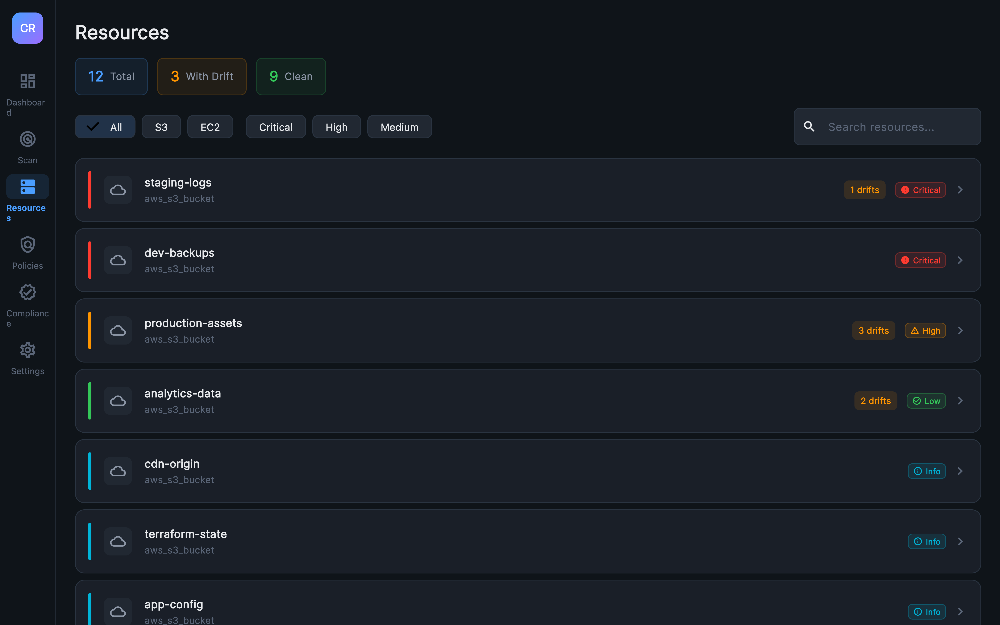
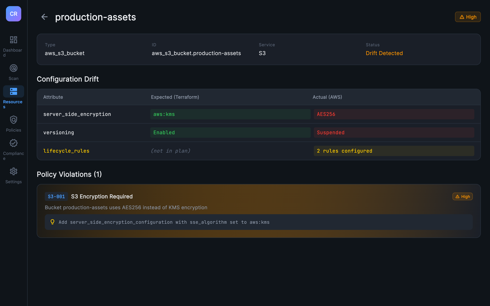

<p align="center">
  <h1 align="center">Cloudrift UI</h1>
  <p align="center">
    <strong>Desktop security dashboard for Cloudrift</strong>
  </p>
  <p align="center">
    Visualize infrastructure drift, policy violations, and compliance posture — powered by the <a href="https://github.com/inayathulla/cloudrift">Cloudrift CLI</a>
  </p>
</p>

<p align="center">
  <a href="https://github.com/inayathulla/cloudrift"></a>
  <a href="https://flutter.dev"></a>
  <a href="#"></a>
  <a href="https://hub.docker.com/r/inayathulla/cloudrift-ui"></a>
  <a href="LICENSE"></a>
</p>

---

**Cloudrift UI** is a native desktop application that provides a security-grade dashboard for the [Cloudrift](https://github.com/inayathulla/cloudrift) infrastructure governance CLI. It invokes the Cloudrift binary, parses JSON output, and renders real-time drift detection results, policy violations, and compliance scoring in a dark-themed professional interface.

> **Looking for the Web/Docker version?** Starting from [v2.0.0](https://github.com/inayathulla/cloudrift-ui/releases/tag/v2.0.0), Cloudrift UI also runs as a web app via Docker with a Go API backend, Resource Builder, and compliance framework mapping. Pull it from Docker Hub:
>
> ```bash
> docker pull inayathulla/cloudrift-ui:latest
> docker run -d -p 8080:80 -v ~/.aws:/root/.aws:ro inayathulla/cloudrift-ui
> ```
>
> See the [`main`](https://github.com/inayathulla/cloudrift-ui) branch or [Docker Hub](https://hub.docker.com/r/inayathulla/cloudrift-ui) for details.

```
┌────────────────────────────────────────────────────────────────┐
│                      CLOUDRIFT UI                              │
│                                                                │
│   ┌──────────┐    ┌──────────────┐    ┌────────────────────┐  │
│   │ Cloudrift │───▶│  JSON Output  │───▶│   Flutter Desktop  │  │
│   │   CLI     │    │  (stdout)     │    │   Dashboard        │  │
│   └──────────┘    └──────────────┘    └────────────────────┘  │
│                                                                │
│   Drift Detection + Policy Engine  ───▶  Visual Analytics     │
└────────────────────────────────────────────────────────────────┘
```

## Table of Contents

- [Features](#features)
- [Screenshots](#screenshots)
- [Prerequisites](#prerequisites)
- [Installation](#installation)
- [Quick Start](#quick-start)
- [Architecture](#architecture)
- [Screens](#screens)
- [Configuration](#configuration)
- [Project Structure](#project-structure)
- [Development](#development)
- [Troubleshooting](#troubleshooting)
- [Related Projects](#related-projects)
- [Contributing](#contributing)
- [License](#license)

## Features

| Feature | Description |
|---------|-------------|
| **Real-time Scanning** | Invoke Cloudrift scans directly from the UI with service and config selection |
| **Drift Visualization** | Three-column diff viewer: Attribute / Expected (Terraform) / Actual (AWS) |
| **Policy Dashboard** | Browse 21 built-in OPA policies with pass/fail status and remediation guidance |
| **Compliance Scoring** | Animated compliance ring with category breakdowns (Security, Tagging, Cost) |
| **Scan History** | Persistent local history with trend charts and severity tracking |
| **Resource Explorer** | Filter and search resources by service, severity, and name |
| **Dark Theme** | Cybersecurity-grade dark theme with severity-coded color system |
| **Cross-Platform** | Native desktop app for macOS, Windows, and Linux |

## Screenshots

### Dashboard
KPI cards, drift trend chart, severity breakdown, recent alerts, and service health — all at a glance.


### Scan & History
Configure and trigger scans with real-time progress. Full scan history table with timestamps, metrics, and status.


### Resource Explorer
Filter by service, severity, or search by name. Severity-coded accent bars for instant visual triage.



### Drift Diff Viewer
Three-column diff: Attribute / Expected (Terraform) / Actual (AWS). Color-coded green/red with remediation.



### Policy Dashboard
All 21 OPA policies with pass/fail status, severity badges, and violation counts per category tab.


### Compliance Scoring
Animated compliance ring with category breakdowns (Security, Tagging, Cost) and trend over time.


### Settings
CLI path configuration, AWS credentials, scan defaults, and data management.


## Prerequisites

1. **Flutter SDK** (3.x or later)
   ```bash
   # Verify installation
   flutter --version
   flutter doctor
   ```

2. **Cloudrift CLI** — the Go binary that performs actual infrastructure scanning
   ```bash
   # Install via Go
   go install github.com/inayathulla/cloudrift@latest

   # Or build from source
   git clone https://github.com/inayathulla/cloudrift.git
   cd cloudrift && go build -o cloudrift .
   ```

3. **AWS credentials** configured (via `~/.aws/credentials` or environment variables)

4. **Terraform plan JSON** — generated from your infrastructure:
   ```bash
   terraform plan -out=tfplan.binary
   terraform show -json tfplan.binary > plan.json
   ```

## Installation

### From Source (Recommended)

```bash
# Clone the repository
git clone https://github.com/inayathulla/cloudrift-ui.git
cd cloudrift-ui

# Install dependencies
flutter pub get

# Run on macOS
flutter run -d macos

# Run on Linux
flutter run -d linux

# Run on Windows
flutter run -d windows
```

### Build Release Binary

```bash
# macOS
flutter build macos

# Linux
flutter build linux

# Windows
flutter build windows
```

The built application will be in `build/<platform>/`.

## Quick Start

### 1. Ensure Cloudrift CLI is available

The UI auto-detects the Cloudrift binary in these locations (in order):
1. Sibling directory: `../cloudrift/cloudrift` (relative to this project)
2. `GOPATH/bin/cloudrift`
3. System PATH: `cloudrift`

You can also set a custom path in **Settings > Cloudrift CLI**.

### 2. Configure and scan

1. Open the app and navigate to the **Scan** tab
2. Select the service to scan (S3 or EC2)
3. Verify the config path points to your `cloudrift.yml`
4. Click **Run Scan**
5. View results across Dashboard, Resources, Policies, and Compliance tabs

### 3. Explore results

- **Dashboard** — KPI cards, drift trend chart, severity pie chart, recent alerts
- **Resources** — Filter by service/severity, click any resource for detailed diff view
- **Policies** — Browse all 21 policies grouped by category (Security/Tagging/Cost)
- **Compliance** — Overall compliance score with category breakdowns and trend

## Architecture

```
┌──────────────────────────────────────────────────────────────┐
│                    Presentation Layer                          │
│  ┌──────────┐ ┌──────────┐ ┌──────────┐ ┌──────────────────┐│
│  │ Dashboard │ │  Scan    │ │Resources │ │Policies/Compliance││
│  └────┬─────┘ └────┬─────┘ └────┬─────┘ └────────┬─────────┘│
│       └─────────────┴────────────┴────────────────┘          │
│                           │                                   │
│               ┌───────────▼───────────┐                      │
│               │   Riverpod Providers  │                      │
│               └───────────┬───────────┘                      │
│                           │                                   │
│                ┌──────────▼──────────┐                       │
│                │   Data Layer        │                        │
│                │  ┌──────────────┐   │                       │
│                │  │ ScanRepository│   │                       │
│                │  └──────┬───────┘   │                       │
│                │  ┌──────▼───────┐   │                       │
│                │  │CLI Datasource│──────▶ Process.run()      │
│                │  │Hive Storage  │   │    → cloudrift binary │
│                │  │Config Reader │   │                       │
│                │  └──────────────┘   │                       │
│                └─────────────────────┘                       │
└──────────────────────────────────────────────────────────────┘
```

### Tech Stack

| Layer | Technology |
|-------|-----------|
| **Framework** | Flutter 3.x (Desktop) |
| **State Management** | Riverpod (providers, StateNotifier) |
| **Navigation** | GoRouter with ShellRoute |
| **Charts** | fl_chart (line, pie) |
| **Local Storage** | Hive (scan history, settings) |
| **Typography** | Google Fonts (Inter, JetBrains Mono) |
| **CLI Integration** | `dart:io` Process.run → JSON parsing |

### Data Flow

1. User clicks **Run Scan** → `ScanNotifier` updates state to `running`
2. `CliDatasource.runScan()` executes the Cloudrift binary via `Process.run()`
3. CLI outputs JSON to stdout (with status lines before the JSON)
4. `_extractJson()` isolates the JSON object from mixed output
5. JSON is parsed into `ScanResult` model
6. `ScanRepository` saves to Hive history and returns result
7. Riverpod providers (`latestScanResultProvider`, `resourceSummariesProvider`, `complianceScoreProvider`) recompute
8. All screens reactively update

## Screens

| Screen | Route | Description |
|--------|-------|-------------|
| **Dashboard** | `/dashboard` | KPI cards, drift trend chart (last 30 scans), severity donut, recent alerts, service health |
| **Scan** | `/scan` | Service selector (S3/EC2), config path, scan trigger with timer, history table |
| **Resources** | `/resources` | Stat chips, filter bar (service/severity/search), clickable resource cards |
| **Resource Detail** | `/resources/:id` | Three-column diff viewer (Attribute/Expected/Actual), policy violations with remediation |
| **Policies** | `/policies` | Tabbed view (All/Security/Tagging/Cost), expandable policy rows with pass/fail |
| **Compliance** | `/compliance` | Animated compliance ring, category cards with mini rings, trend chart |
| **Settings** | `/settings` | CLI path, AWS config, scan defaults, data management |

## Configuration

The UI reads configuration from the Cloudrift CLI's `cloudrift.yml`:

```yaml
# config/cloudrift.yml
aws_profile: default
region: us-east-1
plan_path: ./plan.json
```

### UI Settings

| Setting | Description | Default |
|---------|-------------|---------|
| CLI Binary Path | Path to cloudrift executable | Auto-detected |
| AWS Profile | AWS credentials profile | `default` |
| Region | AWS region to scan | `us-east-1` |
| Policy Directory | Custom OPA policy path | (empty) |
| Fail on Violation | Exit with error on violations | `false` |
| Skip Policies | Run drift detection only | `false` |

## Project Structure

```
cloudrift-ui/
├── lib/
│   ├── main.dart                              # App entry point
│   ├── app.dart                               # MaterialApp.router setup
│   ├── core/
│   │   ├── theme/
│   │   │   ├── app_colors.dart                # Color palette (dark theme)
│   │   │   └── app_theme.dart                 # Material 3 ThemeData
│   │   └── constants/
│   │       └── policy_catalog.dart            # 21 policy definitions
│   ├── data/
│   │   ├── models/                            # Data models
│   │   │   ├── scan_result.dart               # CLI JSON output model
│   │   │   ├── drift_info.dart                # Drift detection result
│   │   │   ├── policy_violation.dart          # Policy violation
│   │   │   ├── evaluation_result.dart         # Policy evaluation
│   │   │   ├── scan_history_entry.dart        # Persisted scan history
│   │   │   ├── resource_summary.dart          # Aggregated resource view
│   │   │   ├── compliance_score.dart          # Compliance calculation
│   │   │   ├── cloudrift_config.dart          # Config model
│   │   │   └── severity.dart                  # Severity enum
│   │   ├── datasources/
│   │   │   ├── cli_datasource.dart            # Process.run bridge to CLI
│   │   │   ├── local_storage_datasource.dart  # Hive persistence
│   │   │   └── config_datasource.dart         # YAML config reader
│   │   └── repositories/
│   │       └── scan_repository.dart           # Coordinates datasources
│   ├── providers/
│   │   └── providers.dart                     # All Riverpod providers
│   └── presentation/
│       ├── router/
│       │   └── app_router.dart                # GoRouter configuration
│       ├── shell/
│       │   └── app_shell.dart                 # NavigationRail sidebar
│       ├── widgets/                           # Shared components
│       │   ├── severity_badge.dart
│       │   ├── metric_card.dart
│       │   ├── glassmorphic_card.dart
│       │   ├── shimmer_loading.dart
│       │   └── empty_state.dart
│       └── screens/                           # 7 screen modules
│           ├── dashboard/
│           ├── scan/
│           ├── resources/
│           ├── resource_detail/
│           ├── policies/
│           ├── compliance/
│           └── settings/
├── test/
│   └── widget_test.dart
├── macos/                                     # macOS platform config
├── linux/                                     # Linux platform config
├── windows/                                   # Windows platform config
└── pubspec.yaml                               # Dependencies
```

## Development

### Prerequisites

```bash
flutter doctor     # Verify Flutter installation
flutter devices    # Check available platforms
```

### Run in Debug Mode

```bash
flutter run -d macos       # macOS
flutter run -d linux       # Linux
flutter run -d windows     # Windows
```

### Analyze Code

```bash
flutter analyze            # Static analysis
flutter test               # Run tests
```

### Build Release

```bash
flutter build macos        # macOS .app bundle
flutter build linux        # Linux executable
flutter build windows      # Windows executable
```

### Key Dependencies

| Package | Purpose |
|---------|---------|
| `flutter_riverpod` | Reactive state management |
| `go_router` | Declarative routing with ShellRoute |
| `fl_chart` | Line and pie charts |
| `google_fonts` | Inter + JetBrains Mono typography |
| `hive` + `hive_flutter` | Local key-value storage |
| `path_provider` | Platform-specific directories |
| `intl` | Date/number formatting |
| `uuid` | Unique scan history IDs |
| `yaml` | YAML config parsing |

## Troubleshooting

### "Cloudrift CLI not found"
Ensure the Cloudrift binary is built and accessible:
```bash
# Build the CLI
cd ../cloudrift && go build -o cloudrift .

# Or install globally
go install github.com/inayathulla/cloudrift@latest
```

### "Operation not permitted" on macOS
The app requires process execution permissions. The macOS sandbox is disabled in entitlements. If you encounter issues:
1. Check `macos/Runner/DebugProfile.entitlements` has `com.apple.security.app-sandbox` set to `false`
2. Clean and rebuild: `flutter clean && flutter run -d macos`

### "No cloudrift.yml file"
The UI looks for the config file in the Cloudrift repo directory:
```bash
# Ensure the config exists
ls ../cloudrift/config/cloudrift.yml
```

### JSON parse errors
The CLI outputs status lines before JSON. The UI automatically extracts the JSON portion. If issues persist, test the CLI directly:
```bash
cd ../cloudrift
./cloudrift scan --config=config/cloudrift.yml --service=s3 --format=json --no-emoji
```

### Hive lock file errors
If the app crashes during startup with lock file errors, delete stale locks:
```bash
rm ~/Documents/cloudrift_hive/*.lock
```

## Related Projects

| Project | Description |
|---------|-------------|
| **[Cloudrift CLI](https://github.com/inayathulla/cloudrift)** | The Go CLI tool that performs infrastructure drift detection and policy evaluation. This UI is a visual frontend for the CLI. |

## Contributing

Contributions are welcome!

```bash
# Clone
git clone https://github.com/inayathulla/cloudrift-ui.git
cd cloudrift-ui

# Install dependencies
flutter pub get

# Run
flutter run -d macos

# Test
flutter test

# Analyze
flutter analyze
```

## Connect

- **Cloudrift CLI:** [github.com/inayathulla/cloudrift](https://github.com/inayathulla/cloudrift)
- **Issues & Features:** [GitHub Issues](https://github.com/inayathulla/cloudrift-ui/issues)
- **Email:** [inayathulla2020@gmail.com](mailto:inayathulla2020@gmail.com)
- **LinkedIn:** [Inayathulla Khan Lavani](https://www.linkedin.com/in/inayathullakhan)

---

## License

[Apache License 2.0](LICENSE)

---

<p align="center">
  <sub>Desktop companion for <a href="https://github.com/inayathulla/cloudrift">Cloudrift</a> — shift-left infrastructure governance</sub>
</p>
