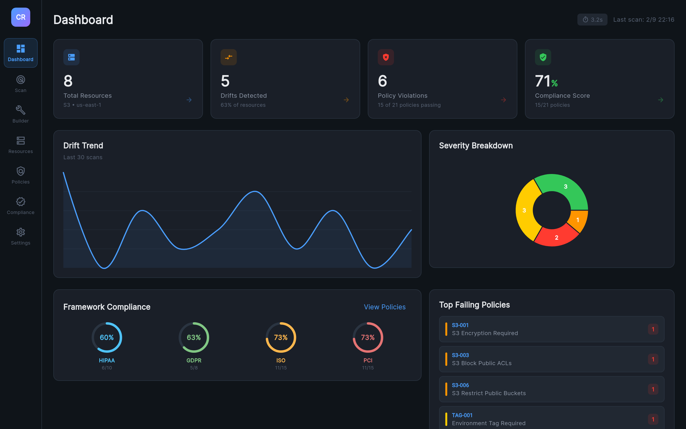
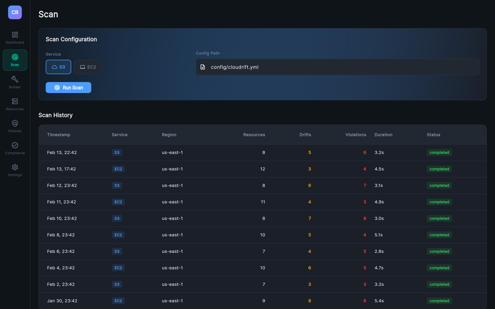
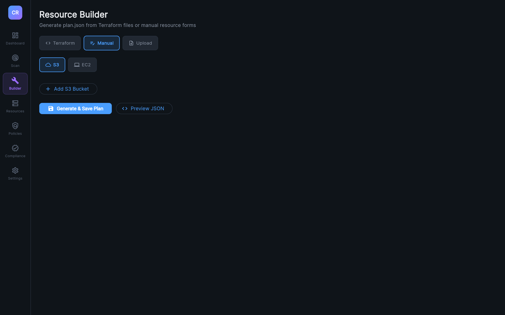
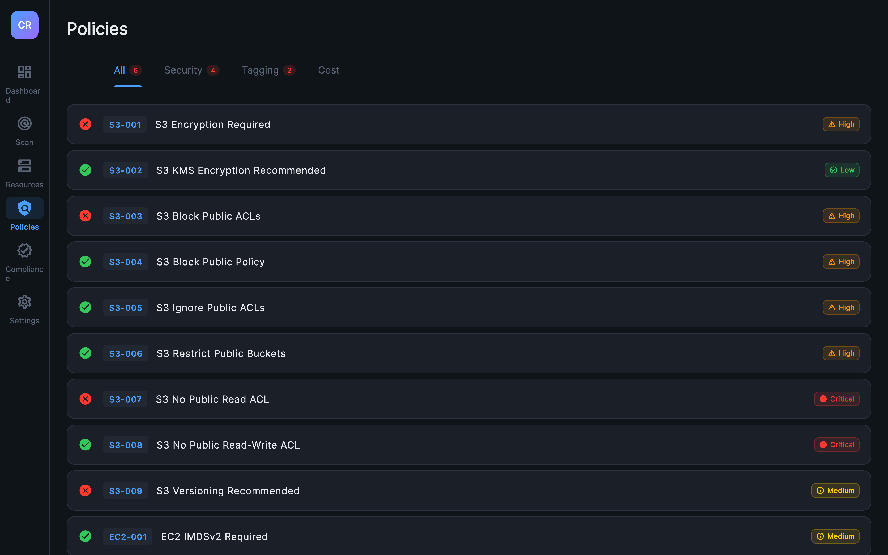
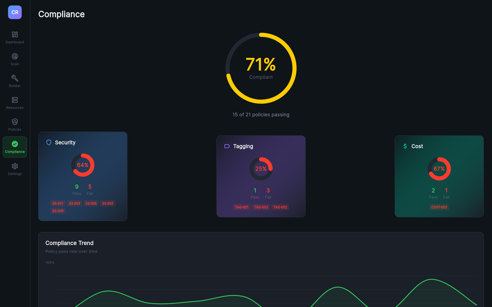
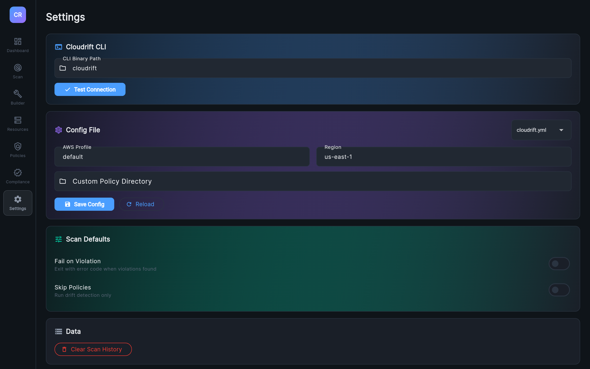

<p align="center">
  <h1 align="center">Cloudrift UI</h1>
  <p align="center">
    <strong>Security dashboard for Cloudrift — Desktop &amp; Web</strong>
  </p>
  <p align="center">
    Visualize infrastructure drift, policy violations, and compliance posture — powered by the <a href="https://github.com/inayathulla/cloudrift">Cloudrift CLI</a>
  </p>
</p>

<p align="center">
  <a href="https://github.com/inayathulla/cloudrift"></a>
  <a href="https://flutter.dev"></a>
  <a href="#"></a>
  <a href="#"></a>
  <a href="LICENSE"></a>
</p>

<p align="center">
  
</p>

---

**Cloudrift UI** is a cross-platform dashboard for the [Cloudrift](https://github.com/inayathulla/cloudrift) infrastructure governance CLI. It runs **two ways**:

> **Web via Docker** — One command deploys a full-stack container with Flutter web app, Go API server, nginx, and Terraform. Open your browser and go.
>
> **Native Desktop** — Runs directly on macOS, Linux, or Windows with the Cloudrift CLI binary. No server needed.

Both modes share the same codebase, the same 7 screens, and full feature parity — drift detection, policy evaluation, compliance scoring, and resource building all work identically regardless of deployment mode.

```
┌─────────────────────────────────────────────────────────────────────┐
│                        CLOUDRIFT UI                                 │
│                                                                     │
│  Desktop Mode                       Web / Docker Mode               │
│  ┌──────────┐    ┌──────────┐      ┌──────────┐    ┌────────────┐  │
│  │ Flutter   │───▶│Cloudrift │      │ Flutter  │───▶│ Go API     │  │
│  │ Desktop   │    │CLI binary│      │ Web App  │    │ Server     │  │
│  └──────────┘    └──────────┘      └──────────┘    └─────┬──────┘  │
│                                                          │         │
│  Drift + Policies ──▶ Visual Analytics      nginx ◀──────┘         │
└─────────────────────────────────────────────────────────────────────┘
```

## Table of Contents

- [Features](#features)
- [What's New in Release 2](#whats-new-in-release-2)
- [Screenshots](#screenshots)
- [Quick Start — Web via Docker (Recommended)](#quick-start--web-via-docker-recommended)
- [Quick Start — Native Desktop](#quick-start--native-desktop)
- [Architecture](#architecture)
- [Screens](#screens)
- [Configuration](#configuration)
- [Project Structure](#project-structure)
- [Development](#development)
- [Troubleshooting](#troubleshooting)
- [Related Projects](#related-projects)
- [Contributing](#contributing)
- [License](#license)

## Features

| Feature | Description |
|---------|-------------|
| **Real-time Scanning** | Invoke Cloudrift scans from the UI with service and config selection |
| **Drift Visualization** | Three-column diff viewer: Attribute / Expected (Terraform) / Actual (AWS) |
| **Policy Dashboard** | 21 built-in OPA policies with severity filters, framework badges, and remediation guidance |
| **Compliance Frameworks** | HIPAA, GDPR, ISO 27001, PCI DSS framework mapping with per-framework compliance rings |
| **Compliance Scoring** | Animated compliance ring with category breakdowns (Security, Tagging, Cost) |
| **Interactive Dashboard** | Clickable KPI cards with navigation, scan duration, framework compliance rings, top failing policies |
| **Resource Builder** | Three modes: Terraform (auto-generate plan.json), Manual (S3/EC2 forms), Upload (drag & drop) |
| **Scan History** | Persistent local history with trend charts and human-readable durations |
| **Resource Explorer** | Filter and search resources by service, severity, and name |
| **Dark Theme** | Cybersecurity-grade dark theme with severity-coded color system |
| **Docker / Web** | One-command Docker deployment with nginx + Go backend + Terraform built in |
| **Cross-Platform** | Desktop (macOS, Windows, Linux) and Web via Docker |

## What's New in Release 2

Release 2 adds **web/Docker deployment**, a **hybrid Resource Builder**, **compliance framework mapping**, and significant UX improvements:

| Area | Change |
|------|--------|
| **Docker / Web** | Single `docker build` produces a container with Flutter web app, Go API server, nginx reverse proxy, and Terraform binary |
| **Go API Server** | Backend API wrapping the Cloudrift CLI for web mode — scan, config, health, version, Terraform plan generation |
| **Resource Builder** | Three-mode builder: **Terraform** (upload .tf files → auto plan.json), **Manual** (S3/EC2 forms), **Upload** (drag & drop plan.json) |
| **Compliance Frameworks** | Policies mapped to HIPAA, GDPR, ISO 27001, PCI DSS with filterable badges |
| **Dashboard Enhancements** | Clickable KPI cards with navigation, framework compliance rings, top failing policies section, scan duration display |
| **Policies Screen** | Severity sorting, framework/severity/status filters, violation counts in tab headers |
| **Navigation** | Per-destination accent colors (blue, teal, purple, pink, orange, green, gray) instead of uniform blue |
| **Scan Duration** | Human-readable format (e.g. "3.2s", "2m 15.3s") throughout the app |
| **Settings** | Unified config editor — load/save `cloudrift.yml` on both web (API) and desktop (file), with policy dir and scan defaults |
| **Performance** | CLI command timeouts (5 min scan, 10 min Terraform), job cleanup goroutine, cached policy filters, efficient string building in Go |

## Screenshots

> All screenshots below are from the **web version running in Docker** (`docker run -p 8080:80 cloudrift-ui`).
> The desktop app renders identically — same screens, same layout, same features.

### Dashboard — KPIs, Drift Trends & Framework Compliance
Clickable KPI cards that navigate to related screens, live drift trend chart, severity donut breakdown, HIPAA/GDPR/ISO 27001/PCI DSS compliance rings, and top failing policies — all at a glance.


---

### Scan & History — Run Scans, Track Results
Select a service (S3/EC2), pick a config file, and trigger a scan. History table shows every past scan with region, drift counts, violation counts, and human-readable durations.



---

### Resource Builder — Terraform, Manual & Upload
Three ways to define your infrastructure plan:
- **Terraform** — Upload `.tf` files and auto-generate `plan.json` (Docker runs `terraform init → plan → show -json`)
- **Manual** — Build S3 buckets and EC2 instances from interactive forms
- **Upload** — Drag & drop an existing `plan.json`



---

### Resource Explorer — Filter, Search & Triage
Filter resources by service type, severity level, or search by name. Each card shows drift count and severity with color-coded accent bars for instant visual triage.


---

### Policy Dashboard — 21 OPA Policies with Compliance Mapping
Every policy is mapped to compliance frameworks (HIPAA, GDPR, ISO 27001, PCI DSS). Filter by severity, framework, or pass/fail status. Violation counts show in tab headers.



---

### Compliance Scoring — Animated Rings & Category Breakdowns
Large animated compliance ring showing overall posture. Category cards (Security, Tagging, Cost) with mini rings and per-policy drill-down. Trend chart shows compliance over time.



---

### Settings — Config File Editor, CLI & Scan Defaults
Load and save `cloudrift.yml` config files (web uses the Go API, desktop reads/writes locally). Configure AWS profile, region, policy directory, and scan behavior. Works identically on both web and desktop.



## Quick Start — Web via Docker (Recommended)

> **Zero dependencies.** The Docker image bundles the Flutter web app, Go API server, nginx reverse proxy, Cloudrift CLI, and Terraform — everything in one container.

```bash
# Build the image
docker build -t cloudrift-ui .

# Run with AWS credentials
docker run -d -p 8080:80 \
  -v ~/.aws:/root/.aws:ro \
  --name cloudrift-ui \
  cloudrift-ui:latest

# Open in browser
open http://localhost:8080
```

### Mount Terraform Files (Optional)

If you have existing `.tf` files, mount them directly:

```bash
docker run -d -p 8080:80 \
  -v ~/.aws:/root/.aws:ro \
  -v /path/to/your/terraform:/etc/cloudrift/terraform \
  --name cloudrift-ui \
  cloudrift-ui:latest
```

The Resource Builder's Terraform mode auto-detects mounted files.

### Docker Workflow

1. Open http://localhost:8080
2. Go to **Builder** → select **Terraform** tab
3. Upload `.tf` files (or they're auto-detected if mounted)
4. Click **Generate Plan from Terraform** — runs `terraform init` → `plan` → `show -json` inside the container
5. Go to **Scan** → click **Run Scan** → view results across all screens

## Quick Start — Native Desktop

> **Direct CLI access.** The desktop app calls the Cloudrift binary directly via `Process.run()` — no server, no container, no network overhead.

### Prerequisites

1. **Flutter SDK** (3.x or later)
   ```bash
   flutter --version
   flutter doctor
   ```

2. **Cloudrift CLI** binary
   ```bash
   go install github.com/inayathulla/cloudrift@latest
   # or build from source
   git clone https://github.com/inayathulla/cloudrift.git
   cd cloudrift && go build -o cloudrift .
   ```

3. **AWS credentials** configured (`~/.aws/credentials` or env vars)

4. **Terraform plan JSON**
   ```bash
   terraform plan -out=tfplan.binary
   terraform show -json tfplan.binary > plan.json
   ```

### Run

```bash
git clone https://github.com/inayathulla/cloudrift-ui.git
cd cloudrift-ui
flutter pub get
flutter run -d macos    # or -d linux / -d windows
```

### CLI Auto-Detection

The desktop app locates the Cloudrift binary in this order:
1. `~/Developer/startup/cloudrift/cloudrift`
2. `~/cloudrift/cloudrift`
3. Sibling directory: `../cloudrift/cloudrift`
4. `$GOPATH/bin/cloudrift`
5. System PATH

Override in **Settings > Cloudrift CLI**.

## Architecture

```
┌──────────────────────────────────────────────────────────────────────────┐
│                         Presentation Layer                                │
│  ┌──────────┐ ┌──────┐ ┌─────────┐ ┌───────────┐ ┌─────────┐ ┌────────┐│
│  │Dashboard │ │ Scan │ │ Builder │ │ Resources │ │Policies │ │Complia.││
│  └────┬─────┘ └──┬───┘ └────┬────┘ └─────┬─────┘ └────┬────┘ └───┬────┘│
│       └───────────┴──────────┴────────────┴────────────┴─────────┘      │
│                                  │                                       │
│                     ┌────────────▼────────────┐                          │
│                     │   Riverpod Providers     │                         │
│                     └────────────┬────────────┘                          │
│                                  │                                       │
│  ┌───────────────────────────────▼───────────────────────────────────┐   │
│  │                        Data Layer                                  │   │
│  │  ┌─────────────────┐  ┌──────────────────┐  ┌─────────────────┐  │   │
│  │  │ CLI Datasource   │  │Config Datasource │  │ Hive Storage    │  │   │
│  │  │                  │  │                  │  │                 │  │   │
│  │  │ Desktop:         │  │ Desktop: YAML    │  │ Scan history    │  │   │
│  │  │  Process.run()   │  │ Web: HTTP /api/  │  │ Settings        │  │   │
│  │  │ Web:             │  │                  │  │                 │  │   │
│  │  │  HTTP /api/scan  │  │                  │  │                 │  │   │
│  │  └─────────────────┘  └──────────────────┘  └─────────────────┘  │   │
│  └───────────────────────────────────────────────────────────────────┘   │
│                                                                          │
│  Docker container (web mode):                                            │
│  ┌──────────────────────────────────────────────────────────────────┐    │
│  │  nginx:80 ──▶ Flutter Web SPA                                     │    │
│  │  nginx:80/api/ ──▶ Go API Server:8081 ──▶ Cloudrift CLI binary   │    │
│  │                                          ──▶ Terraform binary     │    │
│  │  supervisor manages: nginx + go-api                               │    │
│  └──────────────────────────────────────────────────────────────────┘    │
└──────────────────────────────────────────────────────────────────────────┘
```

### Tech Stack

| Layer | Technology |
|-------|-----------|
| **Framework** | Flutter 3.x (Desktop + Web) |
| **State Management** | Riverpod (providers, StateNotifier) |
| **Navigation** | GoRouter with ShellRoute |
| **Charts** | fl_chart (line, pie) |
| **Local Storage** | Hive (scan history, settings) |
| **Typography** | Google Fonts (Inter, JetBrains Mono) |
| **CLI Integration** | Desktop: `dart:io` Process.run / Web: HTTP to Go API |
| **Backend API** | Go net/http server (web mode) |
| **Web Server** | nginx reverse proxy |
| **Container** | Docker multi-stage build with supervisor |
| **IaC** | Terraform binary bundled in Docker image |

### Data Flow

**Desktop mode:**
1. User clicks **Run Scan** → `CliDatasource` calls `Process.run()` on the Cloudrift binary
2. CLI outputs JSON to stdout → `_extractJson()` isolates the JSON
3. Parsed into `ScanResult` → saved to Hive → Riverpod providers recompute → all screens update

**Web/Docker mode:**
1. User clicks **Run Scan** → `CliDatasource` sends `POST /api/scan` to Go backend
2. Go server executes Cloudrift CLI with 5-minute timeout, returns JSON
3. Parsed into `ScanResult` → same provider/screen flow as desktop

## Screens

| Screen | Route | Description |
|--------|-------|-------------|
| **Dashboard** | `/dashboard` | Clickable KPI cards (navigate to related screens), drift trend chart, severity donut, framework compliance rings (HIPAA/GDPR/ISO/PCI), top failing policies |
| **Scan** | `/scan` | Service selector (S3/EC2), config path, scan trigger with timer, history table with human-readable durations |
| **Builder** | `/resource-builder` | Three modes: **Terraform** (upload .tf → auto plan.json), **Manual** (S3/EC2 resource forms), **Upload** (drag & drop plan.json) |
| **Resources** | `/resources` | Stat chips, filter bar (service/severity/search), clickable resource cards |
| **Resource Detail** | `/resources/:id` | Three-column diff viewer (Attribute/Expected/Actual), policy violations with remediation |
| **Policies** | `/policies` | Tabbed (All/Security/Tagging/Cost), severity sorting, framework/severity/status filters, compliance badges (HIPAA/GDPR/ISO/PCI), violation counts |
| **Compliance** | `/compliance` | Animated compliance ring, category cards with mini rings, trend chart |
| **Settings** | `/settings` | CLI path, AWS config, scan defaults, data management |

### Navigation Sidebar

The 88px sidebar uses per-destination accent colors:

| Destination | Color |
|-------------|-------|
| Dashboard | Blue |
| Scan | Teal |
| Builder | Purple |
| Resources | Pink |
| Policies | Orange |
| Compliance | Green |
| Settings | Gray |

## Configuration

The UI reads configuration from `cloudrift.yml`:

```yaml
# config/cloudrift.yml
aws_profile: default
region: us-east-1
plan_path: ./examples/terraform-plan.json
```

### UI Settings

| Setting | Description | Default |
|---------|-------------|---------|
| CLI Binary Path | Path to cloudrift executable | Auto-detected |
| AWS Profile | AWS credentials profile | `default` |
| Region | AWS region to scan | `us-east-1` |
| Policy Directory | Custom OPA policy path | (empty) |
| Skip Policies | Run drift detection only | `false` |

## Project Structure

```
cloudrift-ui/
├── Dockerfile                                # Multi-stage: CLI + Go API + Flutter web + nginx
├── nginx.conf                                # Reverse proxy /api/ → Go backend
├── supervisord.conf                          # Process manager for nginx + Go API
├── server/
│   ├── main.go                               # Go API server (scan, config, terraform, health)
│   └── go.mod
├── web/                                      # Flutter web platform files
│   ├── index.html
│   └── manifest.json
├── lib/
│   ├── main.dart                             # App entry point (desktop + web)
│   ├── app.dart                              # MaterialApp.router setup
│   ├── core/
│   │   ├── theme/
│   │   │   ├── app_colors.dart               # Color palette (dark theme)
│   │   │   └── app_theme.dart                # Material 3 ThemeData
│   │   └── constants/
│   │       └── policy_catalog.dart           # 21 policy definitions + compliance frameworks
│   ├── data/
│   │   ├── models/
│   │   │   ├── scan_result.dart              # CLI JSON output model
│   │   │   ├── drift_info.dart               # Drift detection result
│   │   │   ├── policy_violation.dart         # Policy violation
│   │   │   ├── evaluation_result.dart        # Policy evaluation
│   │   │   ├── scan_history_entry.dart       # Persisted scan history
│   │   │   ├── resource_summary.dart         # Aggregated resource view
│   │   │   ├── compliance_score.dart         # Compliance calculation
│   │   │   ├── cloudrift_config.dart         # Config model
│   │   │   ├── severity.dart                 # Severity enum
│   │   │   ├── plan_builder.dart             # Manual plan builder model
│   │   │   ├── file_list_result.dart         # File listing model
│   │   │   ├── terraform_status.dart         # Terraform availability + files
│   │   │   └── terraform_job.dart            # Async terraform job status
│   │   ├── datasources/
│   │   │   ├── cli_datasource.dart           # Desktop: Process.run / Web: HTTP bridge
│   │   │   ├── local_storage_datasource.dart # Hive persistence
│   │   │   └── config_datasource.dart        # Desktop: YAML / Web: HTTP /api/config
│   │   ├── repositories/
│   │   │   └── scan_repository.dart          # Coordinates datasources
│   │   └── demo_data.dart                    # Sample data for initial state
│   ├── providers/
│   │   └── providers.dart                    # All Riverpod providers
│   └── presentation/
│       ├── router/
│       │   └── app_router.dart               # GoRouter configuration
│       ├── shell/
│       │   └── app_shell.dart                # Custom sidebar with per-destination colors
│       ├── widgets/
│       │   ├── severity_badge.dart           # Severity chip widget
│       │   ├── metric_card.dart              # Interactive KPI card with hover + navigation
│       │   ├── glassmorphic_card.dart        # Frosted glass card
│       │   ├── shimmer_loading.dart          # Loading skeleton
│       │   └── empty_state.dart              # Empty placeholder
│       └── screens/
│           ├── dashboard/                    # KPIs, trends, framework rings, top failures
│           ├── scan/                         # Scan trigger + history
│           ├── resource_builder/             # Terraform / Manual / Upload builder
│           ├── resources/                    # Resource list + filters
│           ├── resource_detail/              # Drift diff viewer
│           ├── policies/                     # Policy catalog with framework badges
│           ├── compliance/                   # Compliance scoring
│           └── settings/                     # App configuration
├── assets/screenshots/                       # Screen captures
├── test/
│   └── widget_test.dart
├── macos/                                    # macOS platform config
├── linux/                                    # Linux platform config
├── windows/                                  # Windows platform config
└── pubspec.yaml                              # Dependencies
```

## Development

### Run Desktop

```bash
flutter pub get
flutter run -d macos       # or -d linux / -d windows
```

### Run Docker (Web)

```bash
docker build -t cloudrift-ui .
docker run -d -p 8080:80 -v ~/.aws:/root/.aws:ro --name cloudrift-ui cloudrift-ui:latest
open http://localhost:8080
```

### Build Release

```bash
# Desktop
flutter build macos        # macOS .app bundle
flutter build linux        # Linux executable
flutter build windows      # Windows executable

# Docker
docker build -t cloudrift-ui:latest .
```

### Code Quality

```bash
flutter analyze            # Static analysis
flutter test               # Run tests
```

### Key Dependencies

| Package | Purpose |
|---------|---------|
| `flutter_riverpod` | Reactive state management |
| `go_router` | Declarative routing with ShellRoute |
| `fl_chart` | Line and pie charts |
| `google_fonts` | Inter + JetBrains Mono typography |
| `hive` + `hive_flutter` | Local key-value storage |
| `path_provider` | Platform-specific directories |
| `intl` | Date/number formatting |
| `uuid` | Unique scan history IDs |
| `yaml` | YAML config parsing |
| `http` | Web mode API calls |
| `file_picker` | Terraform .tf file upload |

## Troubleshooting

### Docker Issues

**Container won't start:**
```bash
docker logs cloudrift-ui    # Check supervisor / nginx / Go API logs
```

**"Failed to reach API server":**
The Go backend may not have started. Check:
```bash
docker exec cloudrift-ui ps aux    # Should show nginx + api-server
docker exec cloudrift-ui curl http://localhost:8081/api/health
```

**Terraform plan fails with auth error:**
Ensure AWS credentials are mounted:
```bash
docker run -v ~/.aws:/root/.aws:ro ...
```

### Desktop Issues

**"Cloudrift CLI not found":**
```bash
# Build the CLI
cd ../cloudrift && go build -o cloudrift .
# Or install globally
go install github.com/inayathulla/cloudrift@latest
```

**"Operation not permitted" on macOS:**
Check `macos/Runner/DebugProfile.entitlements` has `com.apple.security.app-sandbox` set to `false`.
```bash
flutter clean && flutter run -d macos
```

**"No cloudrift.yml file":**
```bash
ls ../cloudrift/config/cloudrift.yml
```

### General

**JSON parse errors:**
Test the CLI directly:
```bash
./cloudrift scan --config=config/cloudrift.yml --service=s3 --format=json --no-emoji
```

**Hive lock file errors:**
```bash
rm ~/Documents/cloudrift_hive/*.lock
```

## Related Projects

| Project | Description |
|---------|-------------|
| **[Cloudrift CLI](https://github.com/inayathulla/cloudrift)** | Go CLI for infrastructure drift detection and OPA policy evaluation |

## Contributing

```bash
git clone https://github.com/inayathulla/cloudrift-ui.git
cd cloudrift-ui
flutter pub get
flutter run -d macos
flutter test
flutter analyze
```

## Connect

- **Cloudrift CLI:** [github.com/inayathulla/cloudrift](https://github.com/inayathulla/cloudrift)
- **Issues & Features:** [GitHub Issues](https://github.com/inayathulla/cloudrift-ui/issues)
- **Email:** [inayathulla2020@gmail.com](mailto:inayathulla2020@gmail.com)
- **LinkedIn:** [Inayathulla Khan Lavani](https://www.linkedin.com/in/inayathullakhan)

---

## License

[Apache License 2.0](LICENSE)

---

<p align="center">
  <sub>Desktop &amp; web companion for <a href="https://github.com/inayathulla/cloudrift">Cloudrift</a> — shift-left infrastructure governance</sub>
</p>
