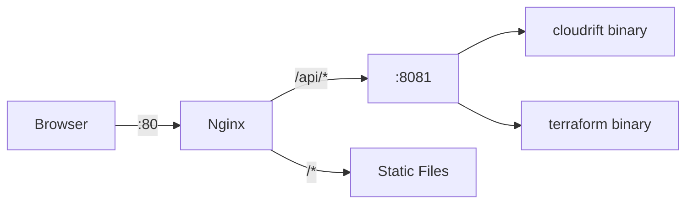

# API Overview

The Cloudrift API server is a Go HTTP server that wraps the CLI binary, providing REST endpoints for the web UI. It runs on port `8081` (configurable via `API_PORT` environment variable) and is reverse-proxied by nginx at `/api/*`.

## Endpoint Summary

| Endpoint | Method | Category | Description |
|----------|--------|----------|-------------|
| `/api/health` | GET | Core | Check CLI availability |
| `/api/version` | GET | Core | Get CLI version string |
| `/api/scan` | POST | Scan | Run infrastructure scan |
| `/api/config` | GET | Config | Read config YAML file |
| `/api/config` | PUT | Config | Write config YAML file |
| `/api/files/plan` | GET | Files | Read plan JSON file |
| `/api/files/plan` | PUT | Files | Write plan JSON file |
| `/api/files/list` | GET | Files | List config and plan files |
| `/api/files/upload` | POST | Files | Upload plan JSON file |
| `/api/files/generate-plan` | POST | Files | Generate plan from form data |
| `/api/terraform/status` | GET | Terraform | Check Terraform availability |
| `/api/terraform/upload` | POST | Terraform | Upload .tf/.tfvars files |
| `/api/terraform/plan` | POST | Terraform | Start async terraform plan |
| `/api/terraform/job` | GET | Terraform | Poll job status |

## CORS

The API server enables CORS for all origins in development:

- `Access-Control-Allow-Origin: *`
- `Access-Control-Allow-Methods: GET, POST, PUT, DELETE, OPTIONS`
- `Access-Control-Allow-Headers: Content-Type`

All `OPTIONS` preflight requests return `204 No Content`.

## Path Security

File operation endpoints validate paths to prevent directory traversal:

- Paths are sanitized using `filepath.Clean`
- Paths containing `..` are rejected with `400 Bad Request`
- File operations are restricted to the config and working directories

## Error Responses

All endpoints return errors in a consistent format:

```json
{
  "error": "Human-readable error description"
}
```

HTTP status codes:

| Code | Meaning |
|------|---------|
| `200` | Success |
| `400` | Bad request (invalid parameters) |
| `404` | Resource not found |
| `405` | Method not allowed |
| `500` | Internal server error |

## Architecture



Nginx handles static file serving for the Flutter web app and reverse-proxies all `/api/*` requests to the Go server on port 8081. The Go server executes CLI and Terraform commands as subprocesses.
