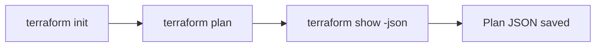

# Terraform Endpoints

The Terraform endpoints support the Resource Builder's Terraform mode. They handle file uploads, async plan execution, and job polling.

## GET /api/terraform/status

Check if Terraform is installed and available.

### Request

```bash
curl http://localhost:8080/api/terraform/status
```

### Response (200)

```json
{
  "available": true,
  "version": "Terraform v1.7.5",
  "tf_files": ["main.tf", "variables.tf"],
  "has_files": true,
  "initialized": false,
  "tf_dir": "/etc/cloudrift/terraform"
}
```

**Fields:**

| Field | Type | Description |
|-------|------|-------------|
| `available` | bool | Terraform binary found on `$PATH` |
| `version` | string | Terraform version string |
| `tf_files` | string[] | List of `.tf` files in the terraform directory |
| `has_files` | bool | Whether any `.tf` files exist |
| `initialized` | bool | Whether `terraform init` has been run (`.terraform` dir exists) |
| `tf_dir` | string | Path to the terraform working directory |

---

## POST /api/terraform/upload

Upload `.tf` and `.tfvars` files for Terraform operations.

### Request

```bash
curl -X POST http://localhost:8080/api/terraform/upload \
  -F "files=@main.tf" \
  -F "files=@variables.tf" \
  -F "files=@terraform.tfvars"
```

**Multipart Fields:**

| Field | Type | Required | Description |
|-------|------|----------|-------------|
| `files` | file[] | yes | One or more `.tf` or `.tfvars` files |

### Response (200)

```json
{
  "status": "ok",
  "uploaded": ["main.tf", "variables.tf", "terraform.tfvars"],
  "tf_dir": "/etc/cloudrift/terraform"
}
```

Files are saved to the Terraform working directory, overwriting any existing files with the same name.

---

## POST /api/terraform/plan

Start an asynchronous Terraform plan operation. This runs three phases sequentially:



### Request

```bash
curl -X POST http://localhost:8080/api/terraform/plan
```

No request body required. Uses the files previously uploaded to the Terraform directory.

### Response (200)

```json
{
  "status": "started",
  "job_id": "abc123-def456"
}
```

The job runs in the background. Use the job ID to poll for status.

### Pipeline Phases

| Phase | Command | Timeout | Description |
|-------|---------|---------|-------------|
| `init` | `terraform init` | 10 min | Download providers, initialize backend |
| `plan` | `terraform plan -out=tfplan` | 10 min | Generate execution plan |
| `show` | `terraform show -json tfplan` | 5 min | Convert to JSON format |

Each phase must complete before the next starts. If any phase fails, the job is marked as failed with the error message.

---

## GET /api/terraform/job

Poll the status of a running Terraform plan job.

### Request

```bash
curl "http://localhost:8080/api/terraform/job?id=abc123-def456"
```

**Query Parameters:**

| Parameter | Type | Required | Description |
|-----------|------|----------|-------------|
| `id` | string | yes | Job ID from the plan response |

### Response — Running

```json
{
  "id": "abc123-def456",
  "status": "running",
  "phase": "plan",
  "error": "",
  "plan_path": "",
  "elapsed_s": 15.2,
  "output": "Initializing provider plugins...\nTerraform has been successfully initialized!\nPlanning..."
}
```

### Response — Completed

```json
{
  "id": "abc123-def456",
  "status": "completed",
  "phase": "show",
  "error": "",
  "plan_path": "/etc/cloudrift/examples/terraform-plan.json",
  "elapsed_s": 42.5,
  "output": "...plan output..."
}
```

### Response — Failed

```json
{
  "id": "abc123-def456",
  "status": "failed",
  "phase": "init",
  "error": "Error: Failed to install provider",
  "plan_path": "",
  "elapsed_s": 8.1,
  "output": "Initializing provider plugins...\nError: Failed to install provider"
}
```

**Job Status Values:**

| Status | Meaning |
|--------|---------|
| `running` | Job is currently executing |
| `completed` | All phases finished successfully |
| `failed` | A phase failed with an error |

### Job Cleanup

Completed and failed jobs are automatically cleaned up after 1 hour. The cleanup runs every 10 minutes.

## Typical Workflow

```bash
# 1. Check Terraform is available
curl http://localhost:8080/api/terraform/status

# 2. Upload Terraform files
curl -X POST http://localhost:8080/api/terraform/upload \
  -F "files=@main.tf" -F "files=@variables.tf"

# 3. Start the plan
JOB_ID=$(curl -s -X POST http://localhost:8080/api/terraform/plan | jq -r '.job_id')

# 4. Poll until complete
while true; do
  STATUS=$(curl -s "http://localhost:8080/api/terraform/job?id=$JOB_ID")
  echo "$STATUS" | jq '.status, .phase'
  [ "$(echo $STATUS | jq -r '.status')" != "running" ] && break
  sleep 2
done

# 5. Use the generated plan for scanning
PLAN_PATH=$(echo $STATUS | jq -r '.plan_path')
curl -X POST http://localhost:8080/api/scan \
  -H "Content-Type: application/json" \
  -d "{\"service\":\"s3\",\"config_path\":\"/etc/cloudrift/config/cloudrift.yml\"}"
```
