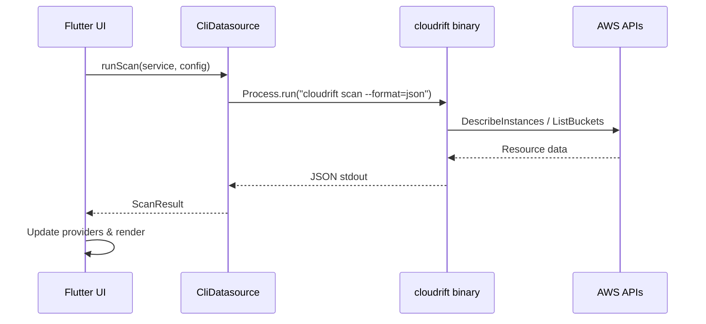
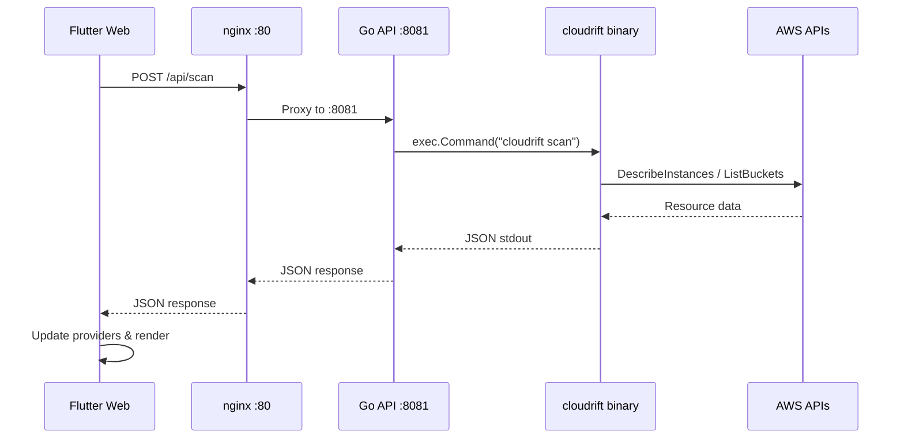
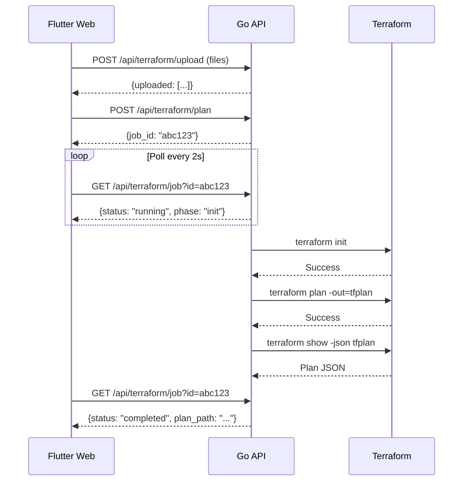
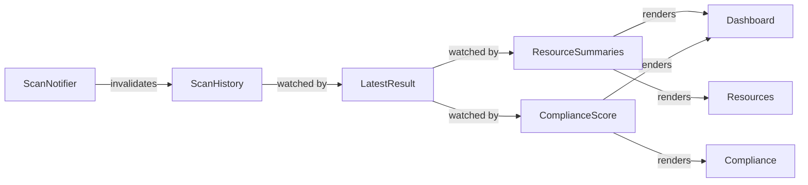

# Data Flow

Cloudrift has two distinct data flow paths depending on whether it's running as a desktop app or in Docker.

## Desktop Data Flow

**Desktop path details:**

1. User clicks "Run Scan" on the Scan screen
2. `ScanNotifier` calls `ScanRepository.runScan()`
3. `ScanRepository` calls `CliDatasource.runScan()`
4. `CliDatasource._runScanDesktop()` invokes `Process.run` with the CLI binary
5. CLI args: `scan --config=<path> --service=<svc> --format=json --no-emoji`
6. Working directory is set to the CLI repo folder
7. CLI queries AWS APIs and evaluates OPA policies
8. JSON output is parsed from stdout using `_extractJson()`
9. `ScanResult.fromJson()` deserializes the response
10. `ScanNotifier` updates state → all dependent providers recompute

## Web Data Flow

**Web path details:**

1. Same UI trigger, but `kIsWeb` is `true`
2. `CliDatasource._runScanWeb()` sends HTTP POST to `/api/scan`
3. nginx proxies the request to the Go API on port 8081
4. Go API executes the CLI binary as a subprocess
5. CLI output is captured and returned as JSON
6. Response flows back through nginx to the browser
7. Same `ScanResult.fromJson()` deserialization

## Terraform Data Flow (Web Only)

## State Flow

All derived providers use Riverpod's `watch` mechanism. When `ScanNotifier` completes a scan, it invalidates `scanHistoryProvider`, which triggers a cascade of recomputations through all dependent providers. The UI rebuilds automatically.
