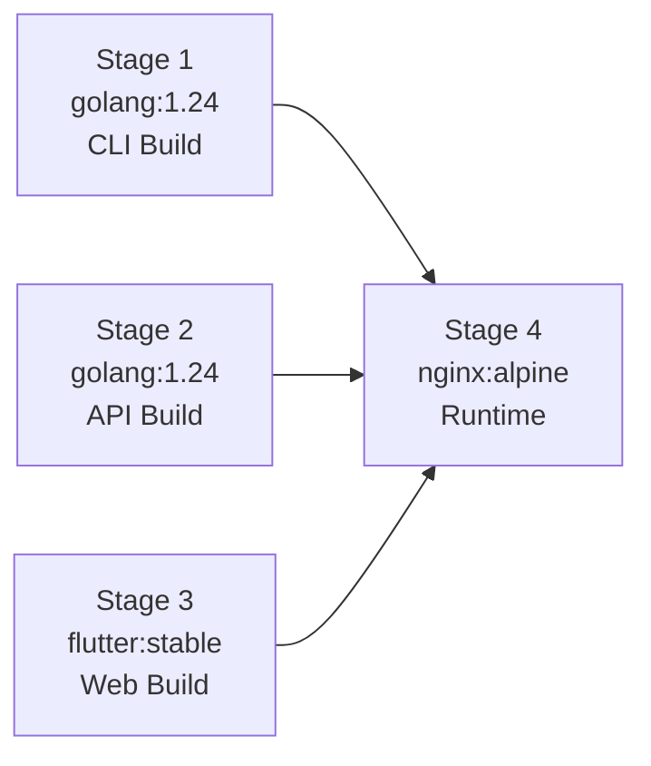

# Deployment

## Docker Deployment

The Docker image uses a 4-stage multi-stage build to produce a minimal runtime container.

### Build Stages



#### Stage 1: CLI Build (`cli-build`)

```dockerfile
FROM golang:1.24 AS cli-build
# Clones the Cloudrift CLI repository
# Cross-compiles with CGO_ENABLED=0 GOOS=linux
# Output: /cli/cloudrift
```

Produces a statically-linked Linux binary of the Cloudrift CLI.

#### Stage 2: API Server Build (`api-build`)

```dockerfile
FROM golang:1.24 AS api-build
# Copies server/go.mod and server/main.go
# Compiles with CGO_ENABLED=0 GOOS=linux
# Output: /api/cloudrift-api
```

Produces the Go REST API server binary.

#### Stage 3: Flutter Web Build (`web-build`)

```dockerfile
FROM ghcr.io/cirruslabs/flutter:stable AS web-build
# Runs flutter pub get
# Builds with flutter build web --release
# Output: /app/build/web/
```

Produces optimized static web files (HTML, JS, CSS, assets).

#### Stage 4: Runtime

```dockerfile
FROM nginx:alpine
# Installs: supervisor, wget, unzip
# Downloads Terraform 1.7.5
# Copies binaries and configs from previous stages
```

The final image contains:

| Component | Location |
|-----------|----------|
| CLI binary | `/usr/local/bin/cloudrift` |
| API server | `/usr/local/bin/cloudrift-api` |
| Flutter web | `/usr/share/nginx/html` |
| Terraform | `/usr/local/bin/terraform` |
| nginx config | `/etc/nginx/conf.d/default.conf` |
| supervisord | `/etc/supervisord.conf` |
| Default configs | `/etc/cloudrift/config/` |
| Example plans | `/etc/cloudrift/examples/` |

### Process Management

`supervisord` runs three processes:

| Process | Command | Port |
|---------|---------|------|
| nginx | `nginx -g 'daemon off;'` | 80 |
| cloudrift-api | `cloudrift-api` | 8081 |

### nginx Configuration

```
┌─────────────────────────────────────────┐
│                nginx :80                 │
├─────────────────────────────────────────┤
│  /api/*    → proxy to :8081 (Go API)    │
│  /*        → /usr/share/nginx/html      │
│            → fallback to index.html     │
├─────────────────────────────────────────┤
│  gzip: text, css, json, js             │
│  no-cache: index.html, service_worker  │
│  proxy_read_timeout: 300s              │
└─────────────────────────────────────────┘
```

### Environment Variables

| Variable | Default | Description |
|----------|---------|-------------|
| `API_PORT` | `8081` | Go API server listen port |
| `TF_PLUGIN_CACHE_DIR` | `/var/cache/terraform-plugins` | Terraform provider cache |

### Building the Image

```bash
docker build -t cloudrift-ui .
```

### Running

```bash
docker run -p 8080:80 \
  -v ~/.aws:/root/.aws:ro \
  cloudrift-ui
```

### Docker Hub

```bash
docker pull inayathulla/cloudrift-ui:latest
```

## Desktop Deployment

The macOS desktop app is built with Flutter:

```bash
flutter build macos --release
```

Output: `build/macos/Build/Products/Release/cloudrift_ui.app` (~44 MB)

### Requirements

- macOS 13+ (Ventura or later)
- Cloudrift CLI binary installed and accessible
- AWS credentials configured (`~/.aws/credentials`)
- Xcode 15+ (for building from source)

## GitHub Pages (Documentation)

The documentation site is deployed via GitHub Actions:

```yaml
on:
  push:
    branches: [main]
    paths: ['docs/**', 'mkdocs.yml']
```

The workflow builds with `mkdocs build --strict` and deploys to the `gh-pages` branch using `mkdocs gh-deploy`.
