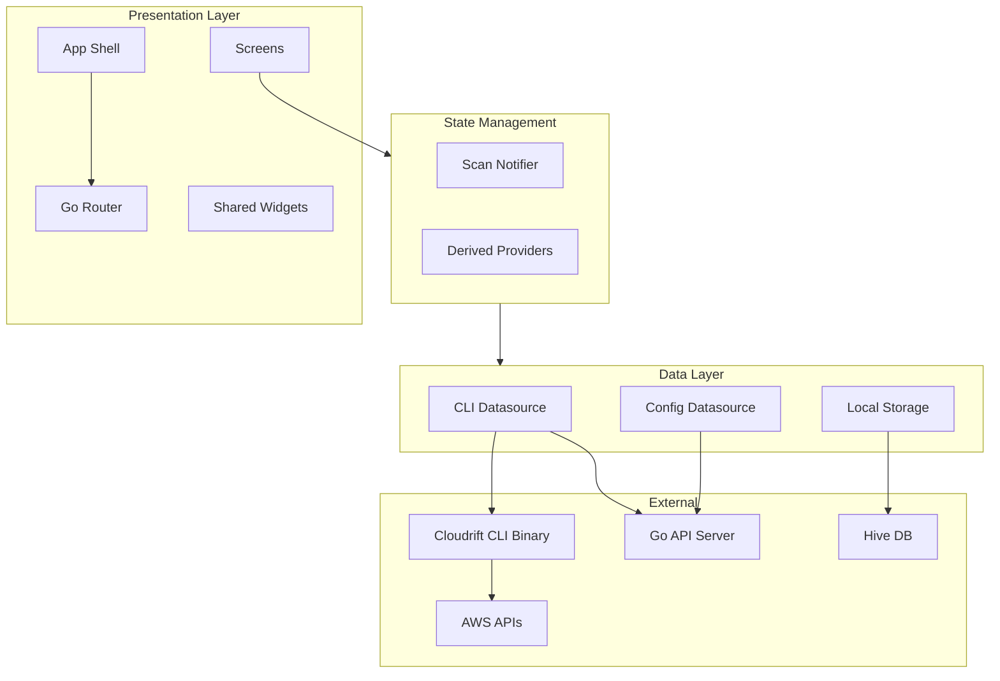

# Architecture Overview

Cloudrift UI follows **Clean Architecture** principles with a clear separation between data, domain, and presentation layers.

## Layer Diagram

## Tech Stack

| Layer | Technology | Purpose |
|-------|-----------|---------|
| **Framework** | Flutter 3.24+ | Cross-platform UI (macOS + Web) |
| **State** | Riverpod 2.6 | Reactive state management |
| **Routing** | GoRouter 14.8 | Declarative navigation with ShellRoute |
| **Charts** | fl_chart 0.70 | Line charts, pie/donut charts, bar charts |
| **Typography** | Google Fonts | Inter (text) + JetBrains Mono (code) |
| **Storage** | Hive 2.2 | NoSQL local storage for scan history |
| **HTTP** | http 1.2 | REST client for web mode |
| **CLI** | Go 1.24 | Infrastructure scanning engine |
| **API Server** | Go net/http | REST API wrapping CLI |
| **Web Server** | nginx alpine | Static serving + reverse proxy |
| **IaC** | Terraform 1.7.5 | Plan generation in Docker |
| **Process Mgr** | supervisord | Multi-process container management |

## Key Design Decisions

### Dual-Mode Architecture

The same Flutter codebase runs as both a native macOS app and a web app:

- **Desktop**: Calls the CLI binary directly via `dart:io` `Process.run`
- **Web**: Calls the Go API server via `package:http` HTTP requests

The `CliDatasource` class abstracts this difference — it checks `kIsWeb` at runtime and routes to the appropriate implementation.

### ShellRoute Pattern

All screens share a persistent navigation sidebar via GoRouter's `ShellRoute`. The `AppShell` widget wraps every screen, providing:

- Navigation rail with 8 destinations
- Color-coded icons per section
- Active route highlighting
- Responsive layout

### Scan History

Scan results are persisted to Hive local storage, enabling:

- Dashboard trend charts across multiple scans
- Resource comparison between scans
- Offline access to previous results

### OPA Policy Engine

The 49 security policies are evaluated by the Go CLI using the Open Policy Agent (OPA) library. Policy results are returned as part of the scan JSON and displayed in the UI.
