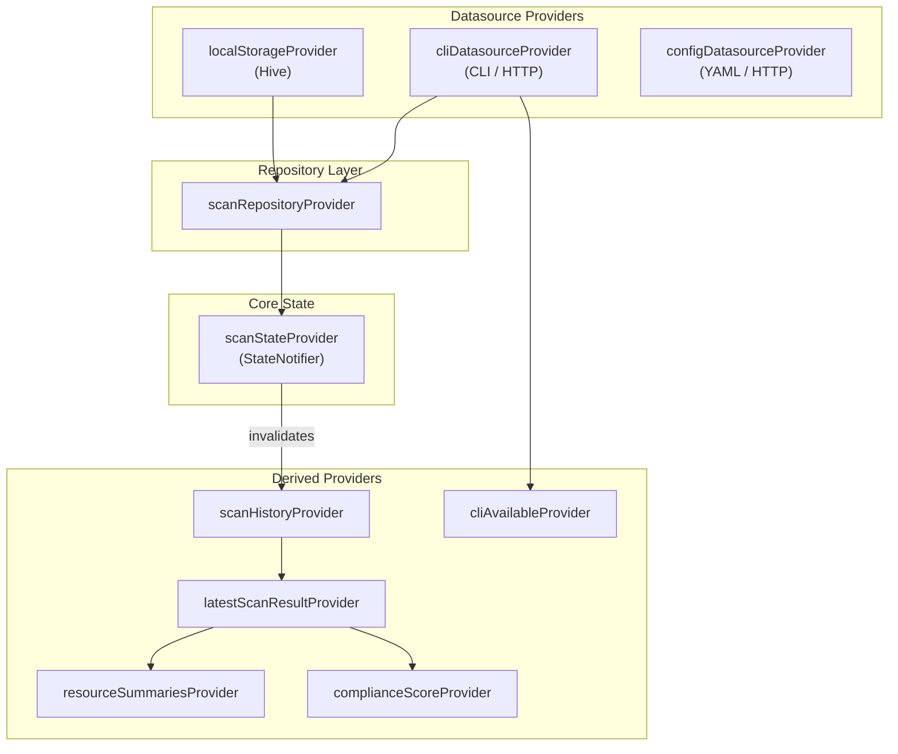

# State Management

Cloudrift uses **Riverpod** for reactive state management. Providers form a dependency graph where changes propagate automatically from data sources to UI widgets.

## Provider Dependency Graph



## Provider Details

### Datasource Providers

| Provider | Type | Description |
|----------|------|-------------|
| `localStorageProvider` | `Provider` | Hive-based local storage for scan history |
| `cliDatasourceProvider` | `Provider` | CLI binary execution (desktop) or HTTP client (web) |
| `configDatasourceProvider` | `Provider` | YAML config reader/writer |

### Repository Provider

| Provider | Type | Description |
|----------|------|-------------|
| `scanRepositoryProvider` | `Provider` | Orchestrates scan execution, persists results |

### Core State

| Provider | Type | Description |
|----------|------|-------------|
| `scanStateProvider` | `StateNotifierProvider<ScanNotifier, ScanState>` | Manages scan lifecycle: idle → running → completed/error |

**ScanState values:**

- `ScanState.idle()` — No scan in progress
- `ScanState.running()` — Scan is executing
- `ScanState.completed(result)` — Scan finished successfully
- `ScanState.error(message)` — Scan failed

### Derived Providers

| Provider | Type | Watches | Description |
|----------|------|---------|-------------|
| `scanHistoryProvider` | `Provider<List<ScanHistoryEntry>>` | localStorage | All stored scan results |
| `latestScanResultProvider` | `Provider<ScanResult?>` | scanHistory | Most recent scan result |
| `resourceSummariesProvider` | `Provider<List<ResourceSummary>>` | latestResult | Aggregated resource data with drift + violations |
| `complianceScoreProvider` | `Provider<ComplianceScore>` | latestResult | Per-framework compliance percentages |
| `cliAvailableProvider` | `FutureProvider<bool>` | cliDatasource | Whether the CLI is reachable |

## Reactivity Model

Riverpod providers use a **pull-based** reactivity model:

1. A widget calls `ref.watch(someProvider)` to subscribe
2. When the provider's value changes, the widget rebuilds
3. Derived providers auto-recompute when their dependencies change

### Invalidation Flow

When a scan completes:

```
ScanNotifier.completeScan()
  → ref.invalidate(scanHistoryProvider)
    → scanHistoryProvider recomputes (reads from Hive)
      → latestScanResultProvider recomputes
        → resourceSummariesProvider recomputes
        → complianceScoreProvider recomputes
          → Dashboard/Resources/Compliance screens rebuild
```

### Usage in Widgets

```dart
class DashboardScreen extends ConsumerWidget {
  @override
  Widget build(BuildContext context, WidgetRef ref) {
    final resources = ref.watch(resourceSummariesProvider);
    final compliance = ref.watch(complianceScoreProvider);
    final scanState = ref.watch(scanStateProvider);

    // Widgets rebuild automatically when any watched provider changes
    return Column(
      children: [
        KpiCards(resources: resources, compliance: compliance),
        if (scanState is ScanRunning) const LinearProgressIndicator(),
      ],
    );
  }
}
```

## Persistence

Scan history is persisted using Hive, a lightweight NoSQL database:

- **Desktop**: Stored in the app's documents directory
- **Web**: Stored in IndexedDB via `hive_flutter`

Each scan result is stored as a `ScanHistoryEntry` containing the full `ScanResult` JSON and a timestamp. History is loaded on app startup and updated after each scan.
