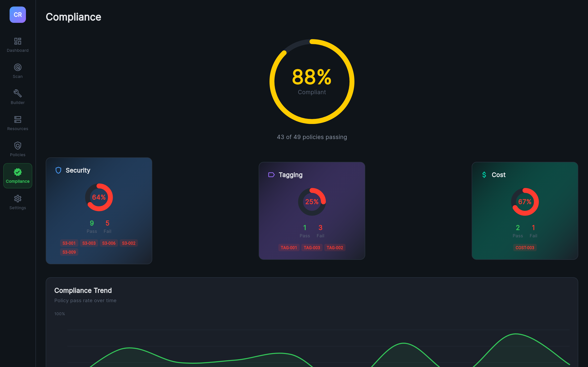

# Compliance Frameworks

Cloudrift maps its 49 security policies to 5 industry compliance frameworks, providing automated compliance scoring.



## Frameworks

### HIPAA (22 policies)

Health Insurance Portability and Accountability Act — protects sensitive patient health information.

**Mapped policies:** S3-001, S3-003, S3-004, S3-005, S3-006, S3-007, S3-008, EC2-002, RDS-001, RDS-002, RDS-005, IAM-001, CT-001, CT-003, KMS-001, EBS-001, EBS-002, LAMBDA-002, ELB-001, ELB-002, LOG-001, LOG-002

**Focus areas:** Encryption at rest, encryption in transit, access controls, audit logging, network isolation.

### GDPR (17 policies)

General Data Protection Regulation — EU regulation on data privacy and protection.

**Mapped policies:** S3-001, S3-003, S3-004, S3-005, S3-006, S3-007, S3-008, EC2-002, RDS-001, RDS-002, IAM-001, CT-001, EBS-001, EBS-002, ELB-002, LOG-001, LOG-002

**Focus areas:** Data encryption, access controls, audit trails, data protection by design.

### ISO 27001 (32 policies)

International standard for information security management systems.

**Mapped policies:** S3-001, S3-003, S3-004, S3-005, S3-006, S3-007, S3-008, S3-009, EC2-001, EC2-002, EC2-003, RDS-001, RDS-002, RDS-003, RDS-004, RDS-005, IAM-001, IAM-002, IAM-003, CT-002, CT-003, KMS-002, EBS-001, LAMBDA-001, LAMBDA-002, ELB-001, ELB-002, ELB-003, LOG-002, VPC-001, VPC-002, SECRET-002

**Focus areas:** Comprehensive security controls, risk management, access management, operations security.

### PCI DSS (34 policies)

Payment Card Industry Data Security Standard — protects cardholder data.

**Mapped policies:** S3-001, S3-002, S3-003, S3-004, S3-005, S3-006, S3-007, S3-008, EC2-001, EC2-002, EC2-003, SG-001, SG-002, SG-003, SG-004, RDS-001, RDS-002, IAM-001, IAM-002, IAM-003, CT-001, CT-002, CT-003, KMS-001, EBS-001, EBS-002, LAMBDA-002, ELB-001, ELB-002, LOG-001, VPC-001, VPC-002, SECRET-001, SECRET-002

**Focus areas:** Network security, strong access control, encryption, monitoring, vulnerability management.

### SOC 2 (49 policies — all)

Service Organization Control 2 — covers security, availability, processing integrity, confidentiality, and privacy.

**Mapped policies:** All 49 policies

**Focus areas:** The most comprehensive framework, covering all aspects of security controls.

## Scoring Calculation

Each framework's compliance score is calculated as:

```
Score = (Passing Policies / Total Mapped Policies) × 100%
```

A policy **passes** if zero violations are found for it across all scanned resources. A single violation causes the policy to fail.

### Score Thresholds

| Score | Color | Rating |
|-------|-------|--------|
| 80–100% | Green | Good |
| 50–79% | Yellow | Needs Improvement |
| 0–49% | Red | Critical |

## Compliance Screen

The Compliance screen shows:

- **Framework cards** — One card per framework with score ring and pass/fail count
- **Policy breakdown** — Expand each framework to see which policies pass and which fail
- **Score categories** — Policies grouped by: Security, Tagging, Cost

## Using Frameworks via CLI

Filter compliance output to specific frameworks:

```bash
cloudrift scan --config=cloudrift-s3.yml --service=s3 --frameworks=hipaa,pci_dss
```

Available framework keys: `hipaa`, `gdpr`, `iso_27001`, `pci_dss`, `soc2`
