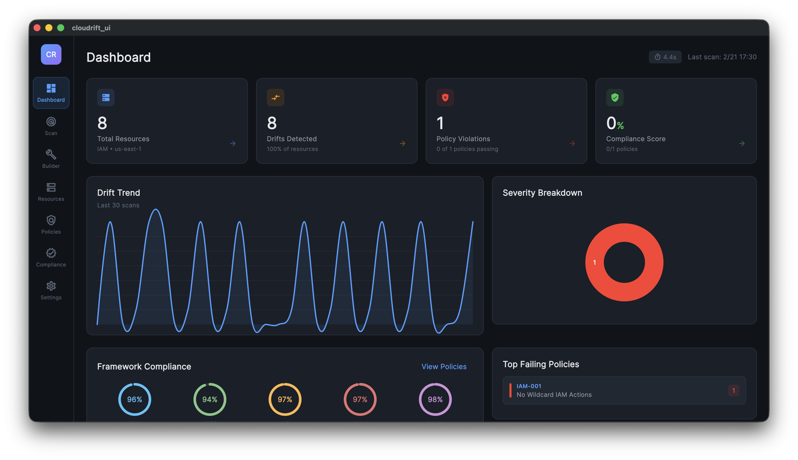

# Dashboard

The Dashboard is the landing screen, providing an at-a-glance overview of your infrastructure's security posture.

## KPI Cards

The top row displays four key performance indicators:

| KPI | Description |
|-----|-------------|
| **Total Resources** | Number of AWS resources found in the latest scan |
| **Drifted Resources** | Resources with configuration differences from Terraform plan |
| **Policy Violations** | Total violations across all 49 security policies |
| **Compliance Score** | Weighted average across enabled compliance frameworks |

Each card shows a trend indicator comparing to the previous scan.

## Compliance Rings

Donut charts visualize compliance scores for each of the 5 frameworks:

- **HIPAA** — Healthcare data protection (22 policies)
- **GDPR** — EU data privacy (17 policies)
- **ISO 27001** — Information security management (32 policies)
- **PCI DSS** — Payment card security (34 policies)
- **SOC 2** — Service organization controls (49 policies — all)

The ring fill and color indicate the score: green (>80%), yellow (50-80%), red (<50%).

## Drift Trend Chart

A line chart tracks drift counts over your scan history, showing how infrastructure drift changes over time. The chart uses the accent blue (`#4A9EFF`) color from the app's palette.

## Violations by Severity

A horizontal bar chart breaks down policy violations by severity level:

- CRITICAL — Immediate security risk
- HIGH — Significant security concern
- MEDIUM — Moderate risk, should be addressed
- LOW — Best practice recommendation

## Navigation

Click any KPI card or chart section to navigate to the relevant detail screen:

- **Total Resources** → Resources screen
- **Drifted Resources** → Resources screen (filtered to drifted)
- **Policy Violations** → Policies screen
- **Compliance Score** → Compliance screen
