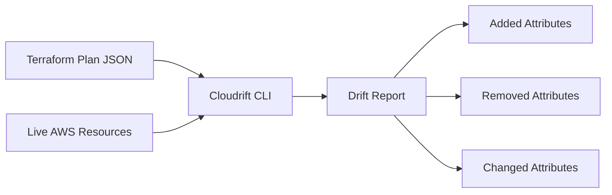

# Drift Detection

Drift detection compares your live AWS infrastructure against Terraform plan files to find configuration differences.

## How It Works

1. **Read Plan** — Parse the Terraform plan JSON to get expected resource state
2. **Query AWS** — Call AWS APIs to get the current live state
3. **Compare** — Diff each attribute between expected and actual
4. **Report** — Categorize differences as added, removed, or changed

## Drift Categories

| Category | Meaning | Example |
|----------|---------|---------|
| **Added** | Attribute exists in AWS but not in plan | New tag added via AWS Console |
| **Removed** | Attribute exists in plan but not in AWS | Encryption removed manually |
| **Changed** | Attribute differs between plan and AWS | Versioning disabled vs enabled |

## Resource Detail View

Click any resource in the Resources list to see the 3-column diff viewer:

| Column | Content |
|--------|---------|
| **Expected** | Value from the Terraform plan |
| **Actual** | Current value from AWS |
| **Status** | Match, Drift, or Missing indicator |

Each attribute row is color-coded:

- **Green** — Values match (no drift)
- **Red** — Values differ (drift detected)
- **Gray** — Attribute only exists on one side

## Resource Summary

The Resources screen aggregates drift data across all scanned resources:

- **Resource type** — AWS resource type (e.g., `aws_s3_bucket`)
- **Resource name** — Terraform resource identifier
- **Drift count** — Number of drifted attributes
- **Violation count** — Number of policy violations
- **Status** — Clean, Drifted, or Violations

Use the search bar and filters to find specific resources or filter by drift status.

## Supported Services

| Service | Resource Types |
|---------|---------------|
| **S3** | Buckets, bucket policies, public access blocks, encryption configs |
| **EC2** | Instances, security groups, volumes, network interfaces |

Additional services can be added by extending the CLI scanner and providing the corresponding Terraform plan files.
