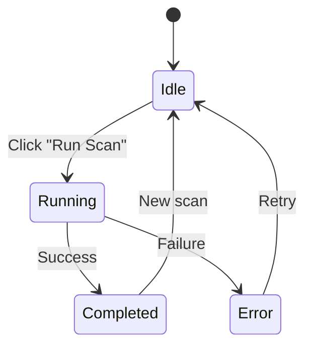

# Scanning

The Scan screen lets you run infrastructure drift detection against your AWS environment.


## Service Selector

Choose which AWS service to scan:

| Service | Config File | Plan File |
|---------|------------|-----------|
| **S3** | `cloudrift-s3.yml` | `plan.json` |
| **EC2** | `cloudrift-ec2.yml` | `ec2-plan.json` |
| **IAM** | `cloudrift-iam.yml` | `iam-plan.json` |

The config path auto-updates when you switch services.

## Scan Parameters

| Parameter | Description | Default |
|-----------|-------------|---------|
| **Config Path** | Path to `cloudrift-<service>.yml` | Auto-detected |
| **Policy Directory** | Custom OPA policy directory | Built-in policies |
| **Skip Policies** | Skip OPA policy evaluation | `false` |

## Scan Lifecycle



### Desktop Mode

On macOS desktop, the scan runs the CLI binary directly:

```bash
cloudrift scan \
  --config=cloudrift-s3.yml \
  --service=s3 \
  --format=json \
  --no-emoji
```

The app invokes this via `Process.run` with the working directory set to the CLI repo folder.

### Web Mode (Docker)

In Docker/web mode, the scan calls the backend API:

```bash
POST /api/scan
Content-Type: application/json

{
  "service": "s3",
  "config_path": "/etc/cloudrift/config/cloudrift-s3.yml"
}
```

The Go API server executes the CLI binary server-side and returns the JSON result.

## Scan Output

A successful scan produces:

- **Drift results** — Per-resource comparison (added/removed/changed attributes)
- **Policy violations** — OPA evaluation results for all applicable policies
- **Compliance scores** — Framework-level pass/fail percentages
- **Resource summaries** — Aggregated view of all scanned resources

Results are stored in local history (Hive on desktop, browser storage on web) and feed the Dashboard, Resources, Policies, and Compliance screens.

## CLI Flags

The full set of CLI flags available for scanning:

| Flag | Short | Description |
|------|-------|-------------|
| `--config` | `-c` | Path to config YAML file |
| `--service` | `-s` | AWS service to scan (s3, ec2, iam) |
| `--format` | `-f` | Output format (json, table, text) |
| `--no-emoji` | — | Disable emoji in output |
| `--policy-dir` | `-p` | Custom OPA policy directory |
| `--skip-policies` | — | Skip policy evaluation |
| `--frameworks` | — | Compliance frameworks to evaluate |
| `--fail-on-violation` | — | Exit non-zero on violations |
