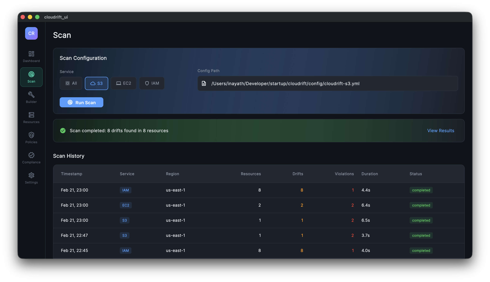
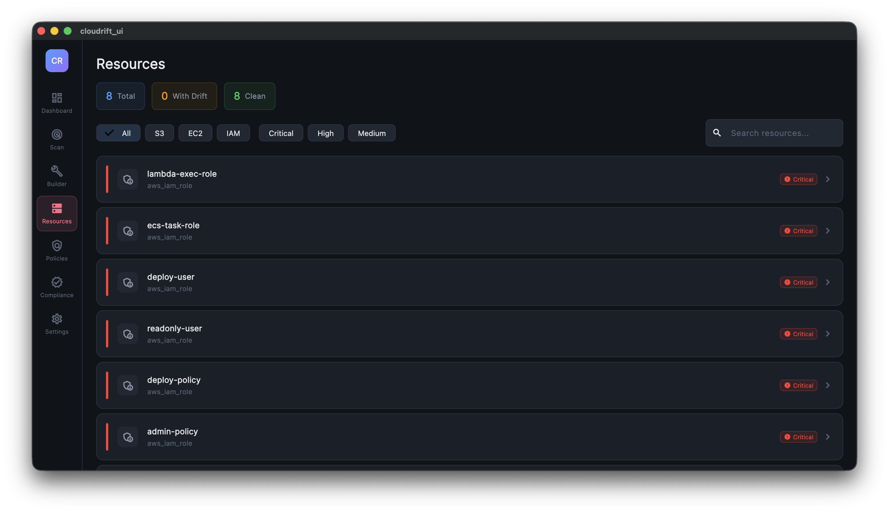
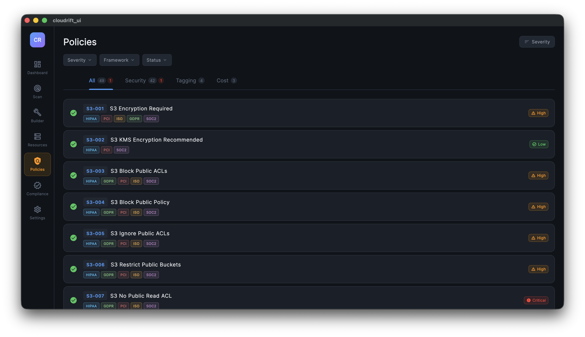

# Cloudrift

**AWS Infrastructure Drift Detection & Compliance Tool**

Cloudrift scans your AWS infrastructure against Terraform plan files to detect configuration drift, evaluate 49 security policies with OPA, and report compliance across 5 industry frameworks — all from a beautiful dark-themed dashboard.


---

## Key Features

<div class="grid cards" markdown>

-   :material-magnify-scan:{ .lg .middle } **Drift Detection**

    ---

    Compare live AWS resources against Terraform plan files. See added, removed, and changed attributes in a 3-column diff viewer.

-   :material-shield-check:{ .lg .middle } **49 Security Policies**

    ---

    OPA-powered policy engine covering S3, EC2, RDS, IAM, Security Groups, CloudTrail, KMS, Lambda, ELB, VPC, and more.

-   :material-clipboard-check:{ .lg .middle } **5 Compliance Frameworks**

    ---

    HIPAA, GDPR, ISO 27001, PCI DSS, and SOC 2 compliance scoring with per-framework breakdowns.

-   :material-hammer-wrench:{ .lg .middle } **Resource Builder**

    ---

    Generate Terraform plan files via Terraform CLI integration, manual JSON editor, or file upload.

-   :material-docker:{ .lg .middle } **Docker & Desktop**

    ---

    Run as a Docker container (web) or native macOS desktop app. Same UI, same features.

-   :material-api:{ .lg .middle } **REST API**

    ---

    14 API endpoints for scanning, configuration, file management, and Terraform operations.

</div>

---

## Quick Start

=== "Docker (Recommended)"

    ```bash
    docker pull inayathulla/cloudrift-ui:latest
    docker run -p 8080:80 \
      -v ~/.aws:/root/.aws:ro \
      inayathulla/cloudrift-ui:latest
    ```

    Open [http://localhost:8080](http://localhost:8080)

=== "Desktop (macOS)"

    ```bash
    git clone https://github.com/inayathulla/cloudrift-ui.git
    cd cloudrift-ui
    flutter pub get
    flutter run -d macos
    ```

[Get Started :material-arrow-right:](getting-started/quick-start.md){ .md-button .md-button--primary }
[View on GitHub :material-github:](https://github.com/inayathulla/cloudrift-ui){ .md-button }

---

## Screenshots

| | |
|:---:|:---:|
|  |  |
| **Dashboard** — KPIs, trends, compliance rings | **Scan** — Service selector, live scan output |
|  |  |
| **Resource Builder** — Terraform / Manual / Upload | **Resources** — Drift summary with filters |
|  |  |
| **Policies** — 49 OPA policies by service | **Compliance** — 5 framework scores |
|  | |
| **Settings** — CLI path, config, theme | |
